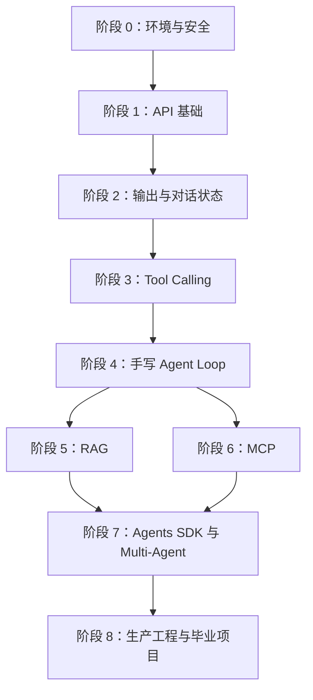

# Agent 工程师课程总路线

课程版本：`1.0.0`  
环境基线：Python 3.12 + uv  
教学粒度：一个 `.py` 文件只学习一个核心功能

## 新聊天的使用方法

在本项目目录中新建 Codex 聊天，然后直接说：

```text
我要进行阶段 3，请按照项目本地教学规划，从进度记录开始教学。
```

Codex 会通过根目录 `AGENTS.md` 读取本课程规则，再读取本文件、`PROGRESS.md` 和对应阶段文件。若想接着当前阶段，可以说：

```text
继续当前阶段，从进度文件中的下一课开始。
```

## 学习路线



## 阶段索引

| 阶段 | 主题 | 课程编号 | 阶段文件 |
|---|---|---:|---|
| 0 | uv、Python 环境、密钥、SDK | 00–02 | [阶段 0](stages/00_foundations.md) |
| 1 | HTTP、Responses、Streaming、异步 | 03–09 | [阶段 1](stages/01_api_basics.md) |
| 2 | 多轮状态、结构化输出、上下文、重试 | 10–15 | [阶段 2](stages/02_model_control.md) |
| 3 | Function/Tool Calling 完整闭环 | 16–25 | [阶段 3](stages/03_tool_calling.md) |
| 4 | 手写 Agent Loop、路由、记忆、停止条件 | 26–31 | [阶段 4](stages/04_agent_loop.md) |
| 5 | 从零 RAG、向量库、混合检索、评测 | 32–46 | [阶段 5](stages/05_rag.md) |
| 6 | MCP Server、Client、Tools、Resources、Prompts | 47–60 | [阶段 6](stages/06_mcp.md) |
| 7 | Agents SDK、Handoff、Guardrail、Multi-Agent | 61–68 | [阶段 7](stages/07_agents_sdk.md) |
| 8 | 配置、日志、持久化、权限、成本、回归评测 | 69–76 | [阶段 8](stages/08_production.md) |

## 稳定约定

- `00–76` 是稳定课程编号；除非修改课程版本，否则不重新编号。
- 阶段可以按聊天拆分，但阶段内必须按依赖顺序推进。
- 每个阶段以一个可运行的小作品结束。
- Tool Calling、RAG、MCP 是不同能力，最终在 Agent Loop 中整合。
- 课程主线先手写底层机制，再学习框架和托管能力。

详细教学节奏见 [教学协议](TEACHING_PROTOCOL.md)，当前状态见 [学习进度](PROGRESS.md)。

